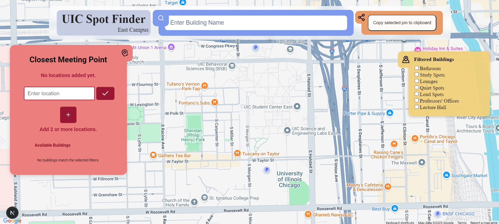
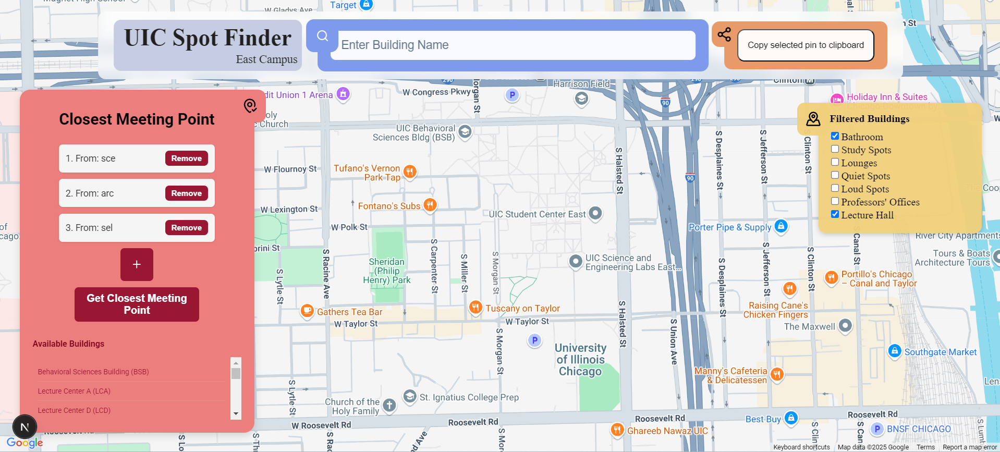
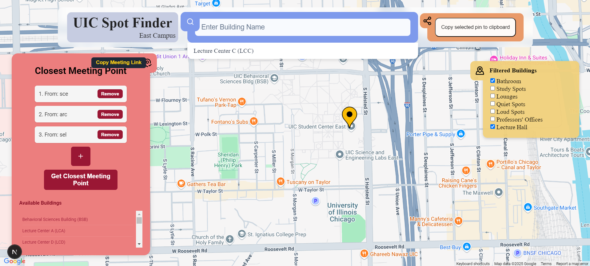

# UIC Spot Finder

## Table of Contents
<dev align="center">
    <table align="center">
        <tr>
            <td><a href="#introduction">Introduction</a></td>        
            <td><a href="#features">Features</a></td>
            <td><a href="#screenshots">Screenshots</a></td>
            <td><a href="#why-this-app">Why This App?</a></td>
            <td><a href="#technologies-used">Technologies Used</a></td>
        </tr>
        <tr>
            <td><a href="#setup-instructions">Setup Instructions</a></td>
            <td><a href="#how-to-use-the-app">How to Use the App</a></td>
            <td><a href="#team-contributions">Team Contributions</a></td>
            <td><a href="#future-improvements">Future Improvements</a></td>
            <td><a href="#feedback">Feedback</a></td>
            <td><a href="#contact">Contact</a></td>
        </tr>
    </table>
</dev>

<p align="right"><a href="#introduction">back to top ⬆️</a></p>

## Introduction
UIC Spot Finder is a full-stack web application that optimizes meeting locations for students and staff on UIC's East Campus. Users select two or more starting points (campus buildings), apply filters (such as "Quiet Spots" or "Lounges"), and the app calculates the most efficient meeting location based on walking distances. The solution integrates real-time location search, filter-based selection, and an optimized backend for geospatial computations.

## Features
- Intelligent location search with autocomplete suggestions
- Filter buildings based on amenities (e.g., Study Spots, Lecture Halls, Lounges)
- Compute an optimized meeting point minimizing walking distances for all users
- Interactive UI for entering locations, viewing available filtered buildings, and copying meeting links
- Smooth user experience with real-time updates

## Screenshots


> *Landing page showcasing the application title, search bar, and interactive map.*


> *Screenshot showing before calculating the computed optimized meeting point on the map after users enter two or more starting buildings and apply filters.*


> *Screenshot showing after calculating the computed optimized meeting point on the map after users enter two or more starting buildings and apply filters.*

## Why This App?
Finding a convenient meeting spot on a large university campus can be challenging, especially when multiple people start from different locations with specific needs (e.g., quiet, study spots). UIC Spot Finder solves this problem by using geospatial algorithms and building metadata to recommend the best meeting location quickly and intuitively.

## Technologies Used
- **Frontend**:
  - Next.js 14 (React framework)
  - CSS (for responsive design)
  - TypeScript
- **Backend**:
  - Flask (Python micro-framework)
  - Geopy (for geodesic distance calculations)
  - SciPy and NumPy (for optimization algorithms)
  - Custom-built Trie data structure for autocomplete

### Backend Choice Justification
Flask was chosen over heavier frameworks like Django to maintain simplicity, lightweight API design, and faster iteration for a project of this scope. Flask provided the flexibility needed for building highly customized graph-based and location-optimized services.

## Setup Instructions

### Backend Setup (Flask API)
1. Navigate to the `backend/` directory.
2. Install required packages:
    ```bash
    pip install -r requirements.txt
    ```
3. Run the server:
    ```bash
    cd src
    python api.py
    ```
4. The backend will be available at `http://localhost:5000/`

### Frontend Setup (Next.js App)
1. Navigate to the `frontend/search-uic/` directory.
2. Install dependencies:
    ```bash
    npm install
    ```
3. Start the frontend development server:
    ```bash
    npm run dev
    ```
4. The frontend will be available at `http://localhost:3000/`

> **Note:** Ensure that the Flask backend is running on port 5000 before starting the frontend, as it depends on backend API responses.

## How to Use the App
1. On the landing page, apply filters such as "Quiet Spots", "Lecture Hall", or "Study Spots". This will filter the available buildings list at the bottom-left, as well as the main search bar. 
2. Enter and select the name of a building in the search bar. This will cause a map icon to appear at that building, along with an option to copy a google maps link to that building at the top-right.
3. After planning out your filters and starting buildings, add multiple starting locations on the left-side.
4. Click "Compute Filtered Meeting Point".
5. View the optimized meeting location suggested on the interactive map.
6. Copy the meeting link for easy sharing!

## Team Contributions
- **Mohammad Nusairat**: Developed and implemented all backend functionality, including API endpoints, graph algorithms, shortest-path computation, and geodesic meeting point optimization (excluding the trie-based autocomplete).
- **Adrian Quiroz**: Led the frontend development, implementing the search bar, location selection, filtering options, meeting point visualization, and map interactions using Next.js's React.js framework, and CSS.
- **Ivan Torres**: Created the trie data structure supporting advanced autocomplete functionality in the backend, assisted with frontend components, and served as project manager by organizing weekly meetings and maintaining project documentation.

## Future Improvements
- Integrate unused backend routes to enable dynamic filtering and backend-driven searches.
- Use meeting point details like surface paths, distances, and summaries to enrich meeting point information.
- Enhance error handling and UX by adding API error messages, better loading states, and empty-state feedback.
- Harden CORS for production by restricting backend access to trusted frontend domains before deployment.
- Integrate user login and session saving for shared meeting planning.
- Extend map to cover off-campus buildings or nearby coffee shops.
- Mobile-optimized UI for better accessibility on smartphones.

## Feedback
We welcome any feedback or suggestions! Feel free to reach out to us via email if you encounter issues or have ideas for improving the project.

## Contact
- Mohammad Nusairat: [mnusa2@uic.edu](mailto:mnusa2@uic.edu)
- Ivan Torres: [itorr4@uic.edu](mailto:itorr4@uic.edu)
- Adrian Quiroz: [aquiro20@uic.edu](mailto:aquiro20@uic.edu)

<p align="right"><a href="#introduction">back to top ⬆️</a></p>

---

> Project developed for FGP Hoover10 Final Project, University of Illinois Chicago.